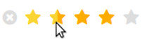

# CSS Star Rating

Inspired by "Pure CSS Star Rating Widget" from:

https://codepen.io/jamesbarnett/pen/vlpkh



## Install

`meteor add kosst:css-star-rating`

## Usage

`{{> rating value=4}}`

Pass a value from 0 to 5 into the reactive `value` attribute.

It's recommended to use a helper, so that we can change the value reactively
later. See below for an example with {{#each}}.

(Note: You can also use half steps for the value, ex. 3.5)

#### Get the value on click

Use events on the `.rating` class.

```
Template.myTemplate.events({
    "click .rating"(event) {
        const value = $(event.target).val();
        console.log(value);
    }
});
```
<a name="each-example"></a>

#### Data context / {{#each}} Example

You can pass any data into the sub-component, for later usage.

(Avoid `disabled` and `defaultValue`, which are reserved for options, see next
section.)

in .html file:

<pre>
&lt;template name="myTemplate"&gt;
    {{#each beer}}
        {{> rating value=rating <b>beer=_id</b>}}
    {{/each}}
&lt;/template>&gt;
</pre>

in .js file:

<pre>
Template.myTemplate.helpers({
    beer() {
        // ex. [{_id: "abc", rating: 2}, {_id: "xyz", rating: 4.5}]
        return Beer.find();
    }
});

Template.myTemplate.events({
    "click .rating"(event) {
        const value = $(event.target).val();
        <b>const beerId = this.beer;</b>
        Beer.update(beerId, { $set: { rating: Number(value) } });
    }
});
</pre>

<a name="options-section"></a> 

## Options

#### Disabled state


`{{> rating value=3 disabled=true}}`

**Important:**

If a disabled component is used in the same template where a `"click .rating"`
event is defined, make also sure on the server side, that the value may not be
changed.

#### Default value

Set a default value, if no value was set. Could be useful in situations, where
no value is defined in database, but you wish to have an initial rating,
different from 0. If a value is defined, the default value is overwritten.

`{{> rating defaultValue=2.5 value=null}}`

## Different style

Different styles can be applied via CSS. Choose any Fontawesome icon.

See http://fontawesome.io/cheatsheet/ for the different unicodes, you can use in
css **content** property.

Example "green batteries":

```
.rating > label:before {
    /* full battery icon */
    content: "\f240";
}

.rating > .half:before {
    /* half battery icon */
    content: "\f242";
}

.rating > input:checked ~ label,
.active.rating:not(:checked) > label:hover,
.active.rating:not(:checked) > label:hover ~ label {
    color: #08AD00;
}

.active.rating > input:checked + label:hover,
.active.rating > input:checked ~ label:hover,
.active.rating > label:hover ~ input:checked ~ label,
.active.rating > input:checked ~ label:hover ~ label {
    color: #7FCD6D;
}

```

## License

MIT

